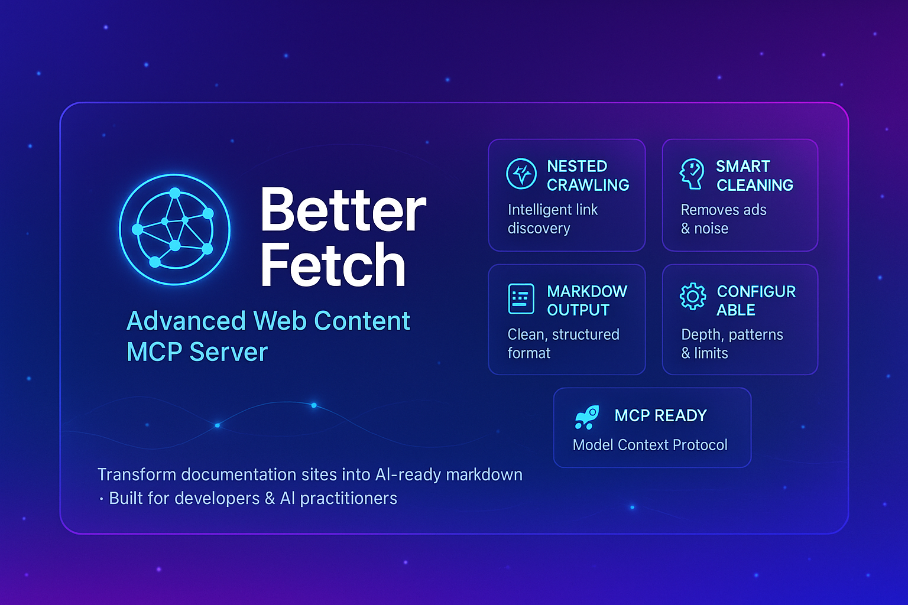

# Better Fetch - Advanced Web Content MCP Server

[](https://opensource.org/licenses/MIT)
[](https://www.typescriptlang.org/)
[](https://nodejs.org/)
[](https://smithery.ai/server/@flutterninja9/better-fetch)

A powerful Model Context Protocol (MCP) server that intelligently fetches and processes web content with nested URL crawling capabilities. Transform any documentation site or web resource into clean, structured markdown files perfect for AI consumption and analysis.

## 🚀 Key Features

### 🕸️ **Smart Web Crawling**
- **Nested URL Fetching**: Automatically discovers and crawls linked pages up to configurable depth
- **Single Page Mode**: Option for simple single-page content extraction
- **Domain Filtering**: Stay within the same domain or allow cross-domain crawling
- **Pattern Matching**: Include/exclude URLs based on regex patterns

### 🧠 **Intelligent Content Processing**
- **Content Cleaning**: Removes ads, navigation, scripts, and other noise automatically
- **Smart Section Detection**: Identifies main content areas (`<main>`, `<article>`, `.content`)
- **Automatic Titles**: Generates meaningful section headers based on page titles and URL structure
- **Table of Contents**: Creates organized TOC with proper nesting

### 📝 **Advanced Markdown Generation**
- **Clean Formatting**: Converts HTML to well-structured markdown
- **Code Block Preservation**: Maintains formatting for code snippets and technical content
- **Link Preservation**: Keeps all important links with proper markdown syntax
- **Metadata Integration**: Includes source URLs, generation timestamps, and site information

### ⚙️ **Highly Configurable**
- **Crawl Depth Control**: Set maximum levels to crawl (default: 2)
- **Page Limits**: Control maximum pages to process (default: 50)
- **Timeout Settings**: Configurable request timeouts
- **Respectful Crawling**: Built-in delays between requests
- **Error Handling**: Graceful handling of failed requests and invalid URLs

## 📋 Available Tools

### 1. `fetch_website_nested`
Comprehensive web crawling with nested URL processing.

**Parameters:**
- `url` (required): Starting URL to crawl
- `maxDepth` (optional, default: 2): Maximum crawl depth
- `maxPages` (optional, default: 50): Maximum pages to process
- `sameDomainOnly` (optional, default: true): Restrict to same domain
- `excludePatterns` (optional): Array of regex patterns to exclude
- `includePatterns` (optional): Array of regex patterns to include
- `timeout` (optional, default: 10000): Request timeout in milliseconds

### 2. `fetch_website_single`
Simple single-page content extraction.

**Parameters:**
- `url` (required): URL to fetch
- `timeout` (optional, default: 10000): Request timeout in milliseconds

## 💡 Use Cases

### 📚 **Documentation Processing**
- **API Documentation**: Convert REST API docs, SDK guides, and technical references
- **Framework Docs**: Process React, Vue, Angular, or any framework documentation
- **Library Guides**: Extract comprehensive guides from library documentation sites
- **Tutorial Series**: Gather multi-part tutorials into single organized documents

### 🔍 **Content Analysis & Research**
- **Competitive Analysis**: Gather competitor documentation and feature descriptions
- **Market Research**: Extract product information from multiple related pages
- **Academic Research**: Collect and organize web-based research materials
- **Knowledge Base Creation**: Transform scattered web content into structured knowledge bases

### 🤖 **AI Training & Context**
- **LLM Context Preparation**: Create clean, structured content for AI model training
- **RAG System Input**: Generate high-quality documents for Retrieval-Augmented Generation
- **Chatbot Knowledge**: Build comprehensive knowledge bases for customer service bots
- **Content Summarization**: Prepare web content for automated summarization tasks

## 🛠️ Installation & Setup

### Installing via Smithery

To install Better Fetch for Claude Desktop automatically via [Smithery](https://smithery.ai/server/@flutterninja9/better-fetch):

```bash
npx -y @smithery/cli install @flutterninja9/better-fetch --client claude
```

### Prerequisites
- Node.js 18+ 
- npm or yarn
- MCP-compatible client (Claude Desktop, VS Code with MCP extension, etc.)

### Step 1: Clone and Install
```bash
git clone https://github.com/yourusername/better-fetch.git
cd better-fetch
npm install
```

### Step 2: Build the Project
```bash
npm run build
```

### Step 3: Test the Server (Optional)
```bash
# Quick test
npm run dev

# Or run comprehensive tests
node test-mcp.js
```

### Step 4: Configure Your MCP Client

#### For Claude Desktop:
Add to your `claude_desktop_config.json`:

```json
{
  "mcpServers": {
    "better-fetch": {
      "command": "node",
      "args": ["/absolute/path/to/better-fetch/dist/server.js"],
      "env": {
        "NODE_ENV": "production"
      }
    }
  }
}
```

#### For VS Code MCP Extension:
```json
{
  "better-fetch": {
    "command": "node",
    "args": ["/Users/yourusername/better-fetch/dist/server.js"]
  }
}
```

#### For Custom MCP Client:
```json
{
  "name": "better-fetch",
  "command": "node",
  "args": ["/path/to/better-fetch/dist/server.js"],
  "stdio": true
}
```

## 📖 Usage Examples

### Basic Documentation Crawling
```
Fetch all the web contents from this Flutter Shadcn UI documentation site:
https://flutter-shadcn-ui.mariuti.com/

Use nested fetching with a maximum depth of 3 levels and process up to 100 pages.
```

### Advanced Configuration
```
Fetch content from the React documentation but exclude any URLs containing 'api' or 'reference' and only process pages containing 'tutorial' or 'guide':

URL: https://react.dev
Max Depth: 2
Exclude Patterns: ["/api/", "/reference/"]
Include Patterns: ["/tutorial/", "/guide/"]
Max Pages: 30
```

### Single Page Extraction
```
Extract the content from this specific page only:
https://nextjs.org/docs/getting-started/installation

Use single page mode to avoid crawling related links.
```

## 📄 Sample Output

The server generates comprehensive markdown files with the following structure:

```markdown
# Site Name Documentation

*Scraped from: https://example.com*
*Generated on: 2024-01-15T10:30:00.000Z*

## Table of Contents

- [Getting Started](#getting-started)
  - [Installation](#installation)
  - [Quick Start](#quick-start)
- [API Reference](#api-reference)
  - [Core Functions](#core-functions)

---

## Getting Started

*Source: [https://example.com/getting-started](https://example.com/getting-started)*

[Clean markdown content here...]

---

## Installation

*Source: [https://example.com/installation](https://example.com/installation)*

[Installation instructions in markdown...]
```

**For a complete example**, refer to [`output.md`](./output.md) which demonstrates the server's output when processing a real documentation site.

## 🔧 Development

### Project Structure
```
better-fetch/
├── src/
│   └── server.ts          # Main server implementation
├── dist/                 # Compiled JavaScript
├── test-mcp.js          # Testing utilities
├── output.md            # Sample output file
├── package.json
├── tsconfig.json
└── README.md
```

### Available Scripts
```bash
npm run dev          # Run in development mode with hot reload
npm run build        # Compile TypeScript to JavaScript
npm run start        # Run the compiled server
npm run clean        # Clean dist directory
npm test             # Run test suite
```

### Testing Your Changes
```bash
# Interactive testing
node interactive-test.js

# Automated test suite
node test-mcp.js

# Manual JSON-RPC testing
echo '{"jsonrpc":"2.0","id":1,"method":"tools/list"}' | node dist/index.js
```

## 🚦 Performance & Limits

### Default Limits
- **Max Depth**: 2 levels (configurable)
- **Max Pages**: 50 pages (configurable)
- **Request Timeout**: 10 seconds (configurable)
- **Crawl Delay**: 500ms between requests (respectful crawling)

### Performance Tips
- Set appropriate `maxPages` limits for large sites
- Use `includePatterns` to focus on relevant content
- Enable `sameDomainOnly` to avoid external link crawling
- Adjust `timeout` based on target site response times

## 🤝 Contributing

We welcome contributions! Please see our [Contributing Guide](CONTRIBUTING.md) for details.

### Development Setup
1. Fork the repository
2. Create a feature branch: `git checkout -b feature/amazing-feature`
3. Make your changes and add tests
4. Commit your changes: `git commit -m 'Add amazing feature'`
5. Push to the branch: `git push origin feature/amazing-feature`
6. Open a Pull Request

## 📜 License

This project is licensed under the MIT License - see the [LICENSE](LICENSE) file for details.

## 🆘 Support & Issues

- **Bug Reports**: [GitHub Issues](https://github.com/yourusername/better-fetch/issues)
- **Feature Requests**: [GitHub Discussions](https://github.com/yourusername/better-fetch/discussions)
- **Documentation**: Check the [Wiki](https://github.com/yourusername/better-fetch/wiki)

## 🙏 Acknowledgments

- Built with the [Model Context Protocol SDK](https://github.com/modelcontextprotocol/sdk)
- Powered by [Cheerio](https://cheerio.js.org/) for HTML parsing
- Markdown conversion by [Turndown](https://github.com/mixmark-io/turndown)

---

**Made with ❤️ for the AI and developer community**
